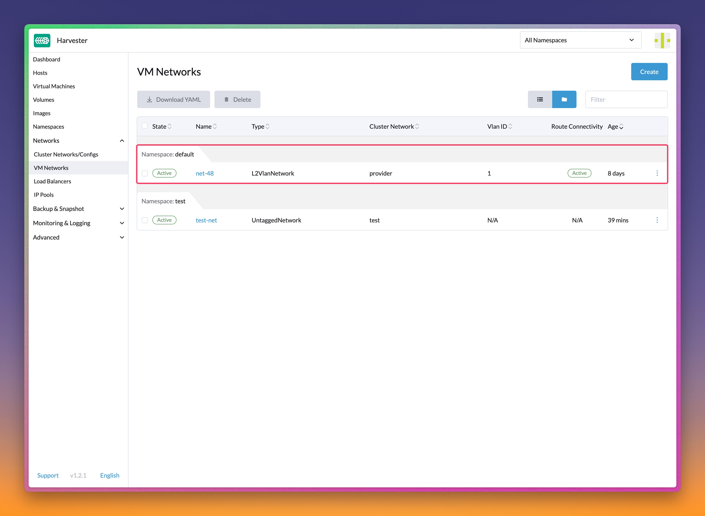

# vm-dhcp-controller

A managed DHCP service for virtual machines running on Harvester, ported from [joeyloman/kubevirt-ip-helper](https://github.com/joeyloman/kubevirt-ip-helper) and its subsidiary projects.

## Features

- DHCP service for virtual machines
  - IP pool declaration (via IPPool custom resources)
  - Per-VM network configuration (via VirtualMachineNetworkConfig custom resources)
  - Static lease support (pre-defined MAC/IP addresses mapping)
- Built-in resiliency in a semi-stateless design
  - States are always kept in etcd
  - Able to reconstruct DHCP leases even when the agent is destroyed and restarted
- Harvester integration
  - Network topology-aware agent (DHCP server) deployment
  - Auto-create IP pool along with **VM Network** creation
  - Auto-create network configuration during VM creation

## Architecture

Introduced CRDs:

- IPPool
- VirtualNetworkNetworkConfig

Components:

- `vm-dhcp-controller` (control plane)
  - Manage the lifecycle of the agent for each IPPool
  - [WIP] Create/remove IPPool when NetworkAttachmentDefinition is created/deleted
  - [WIP] Create/remove VirtualMachineNetworkConfig when VirtualMachine is created/deleted
- `vm-dhcp-agent` (data plane)
  - Maintain DHCP lease store for the IP pool it is responsible for
  - Handle actual DHCP requests

How the controller and agents collaborate to provide DHCP services for virtual machines on Harvester:


## Develop

To generate the controllers/clientsets:

```
go generate
```

## Build

To build the VM DHCP controller/agent and package them into container images:

```
# If you want to have the built images pushed to the designated registry,
# please specify the following two environment variables.
# Also, copy $HOME/.docker under the project directory for `docker push` to work.
export REPO=starbops
export PUSH=true

make
```

If you're on an Apple Silicon Mac with Docker Desktop or OrbStack, and want to build the binary and the image that could be run on a Linux x86_64 box, you'd like to do the following:

```
export ARCH=amd64
make
```

## Run

To run the controller locally attaching to a remote cluster:

```
# Make sure you have the correct config and context set
export KUBECONFIG="$HOME/cluster.yaml"

make run-controller ARGS="--name=test-controller --namespace=default --image=rancher/harvester-vm-dhcp-controller:main-head"
```

Same for the agent (for testing purposes):

```
make run-agent ARGS="--name=test-agent --dry-run"
```

## Install

To install the VM DHCP controller using Helm:

```
helm upgrade --install harvester-vm-dhcp-controller ./chart --namespace=harvester-system --create-namespace
```

The agents will be scaffolded dynamically according to the requests.

## Usage

Create **VM Network** `default/net-48` before proceeding.



Create IPPool object:

```
$ cat <<EOF | kubectl apply -f -
apiVersion: network.harvesterhci.io/v1alpha1
kind: IPPool
metadata:
  name: ippool-1
  namespace: default
  labels:
    k8s.cni.cncf.io/net-attach-def: net-48
spec:
  ipv4Config:
    serverIP: 192.168.48.77
    cidr: 192.168.48.0/24
    pool:
      start: 192.168.48.81
      end: 192.168.48.90
      exclude:
      - 192.168.48.81
      - 192.168.48.90
    router: 192.168.48.1
    dns:
    - 1.1.1.1
    domainName: aibao.moe
    domainSearch:
    - aibao.moe
    ntp:
    - pool.ntp.org
    leaseTime: 300
  networkName: default/net-48
EOF
```

Create VirtualMachineNetworkConfig object:

```
$ cat <<EOF | kubectl apply -f -
apiVersion: network.harvesterhci.io/v1alpha1
kind: VirtualMachineNetworkConfig
metadata:
  name: test-vm
  namespace: default 
  labels:
    harvesterhci.io/vmName: test-vm
spec:
  vmName: test-vm
  networkConfig:
  - macAddress: fa:cf:8e:50:82:fc
    networkName: default/net-48
EOF
```
